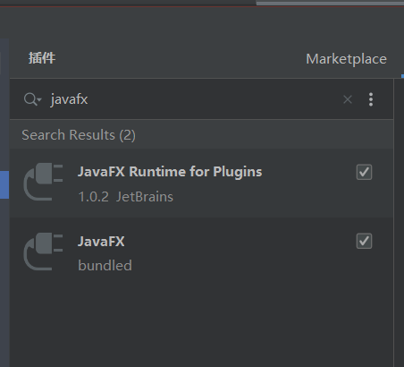
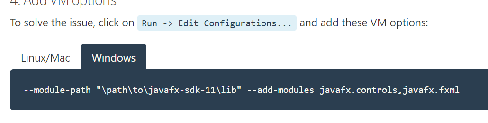
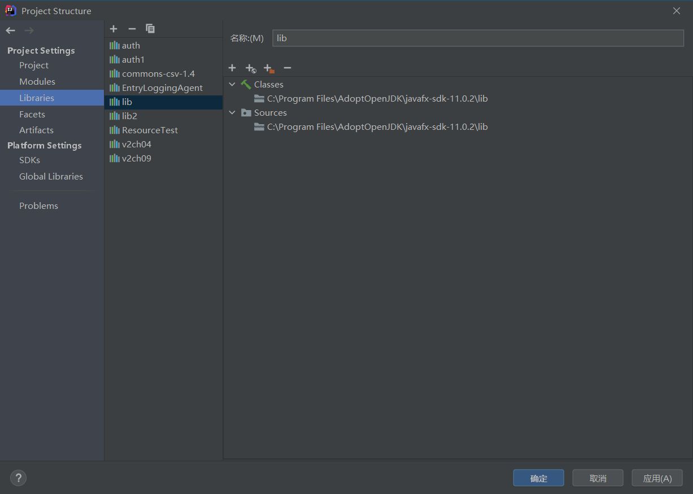
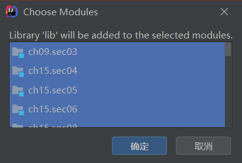
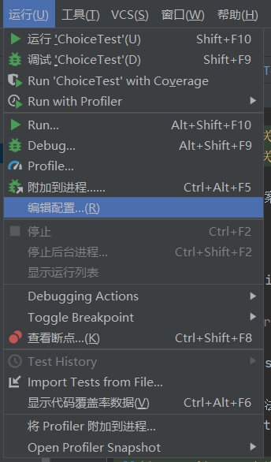
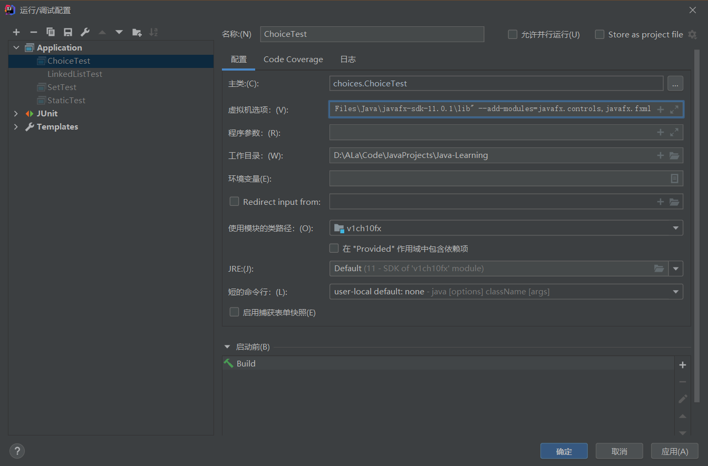
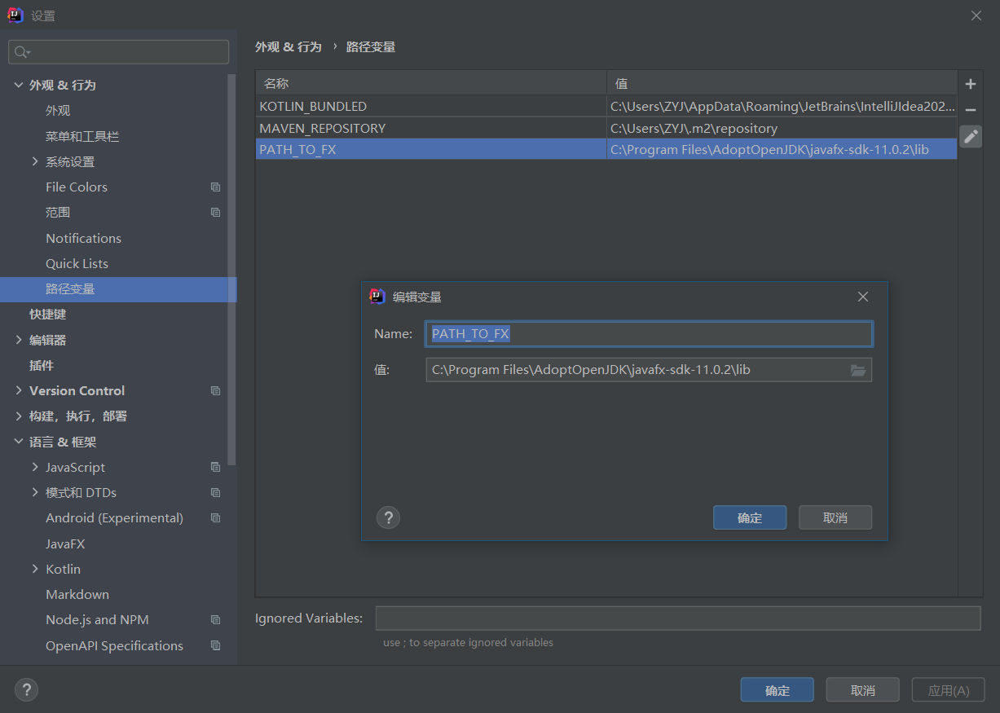
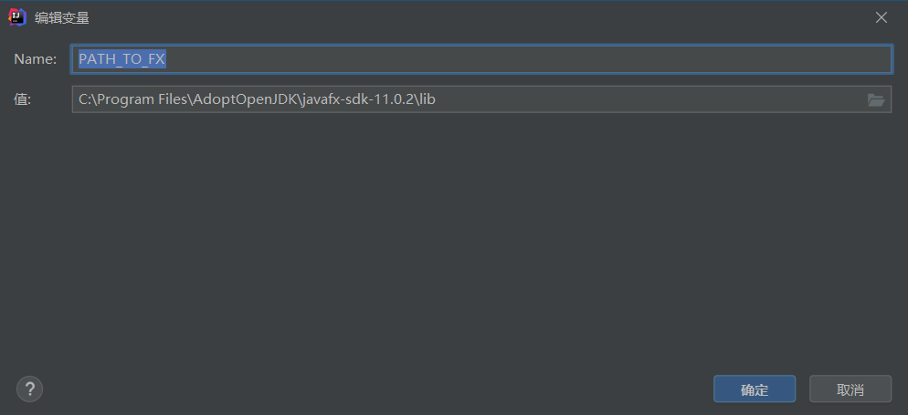
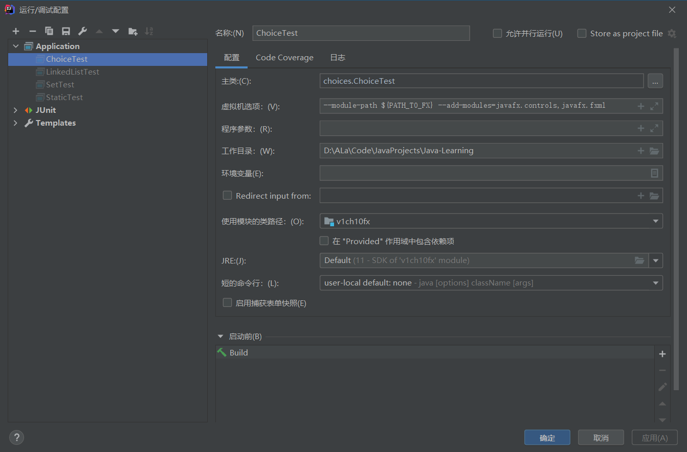

# Enter Description name here
Created by ZYJ at 2020/10/12

中文互联网上没有一个靠谱的答案，最后在Stack Overflow上找到了问题实际的原因和解决方法

根据官方文档
本文使用的javafx是openjfx

1.两个IDEA中关于javafx的插件


其中第一个是用于idea中新建一个javafx项目的，而第二个是使用Oracle公司的javafx的必备插件，它们和本文的解决方案都没有关系

2.根据[openjfx的官方文档](https://openjfx.io/openjfx-docs/#install-java)

更新：最新的官方文档中已经把这个误导性描述改了


但是中文互联网上信息更新明显慢外网两年，建议大家抛弃百度，使用谷歌，然后把你的问题翻译成英文搜索答案，找到正确答案后再翻译回来阅读。

其中%PATH_TO_FX%一项实际上是指代一个确定的、实际的绝对路径，

我来叙述一下实际的配置方法。

在library中添加openjfx目录下的lib文件夹，并将其指定应用在你需要import javafx包的模块中

File -> Project Structure -> Libraries

add the JavaFX11/lib/




接下来的步骤有两种解决方案

第一种：

点击Run -> Edit Configurations...，,

并在 VM 选项(VM options)中添加路径：
```
--module-path "C:\Program Files\Java\javafx-sdk-11.0.1\lib" --add-modules=javafx.controls,javafx.fxml
```


其中"C:\Program Files\Java\javafx-sdk-11.0.1\lib"要换成你的javafx的实际路径


注意一定是要修改你实际上需要运行的那个类(即含有import javafx语句的那个类)


第二种方案（更加永久的方法）：
IntelliJ->File->Settings->Appearance & Behavior->Path Variables



新增一个PATH_TO_FX变量，路径指向openjfx/lib文件夹

例如：


然后点击Run -> Edit Configurations...，,


并在 VM 选项(VM options)中添加路径：
```java
--module-path ${PATH_TO_FX} --add-modules=javafx.controls,javafx.fxml
```
注意与上面不同的是，将%PATH_TO_FX%改为$PATH_TO_FX$或者${PATH_TO_FX}



注意一定是要修改你实际上需要运行的那个类(即含有import javafx语句的那个类)

